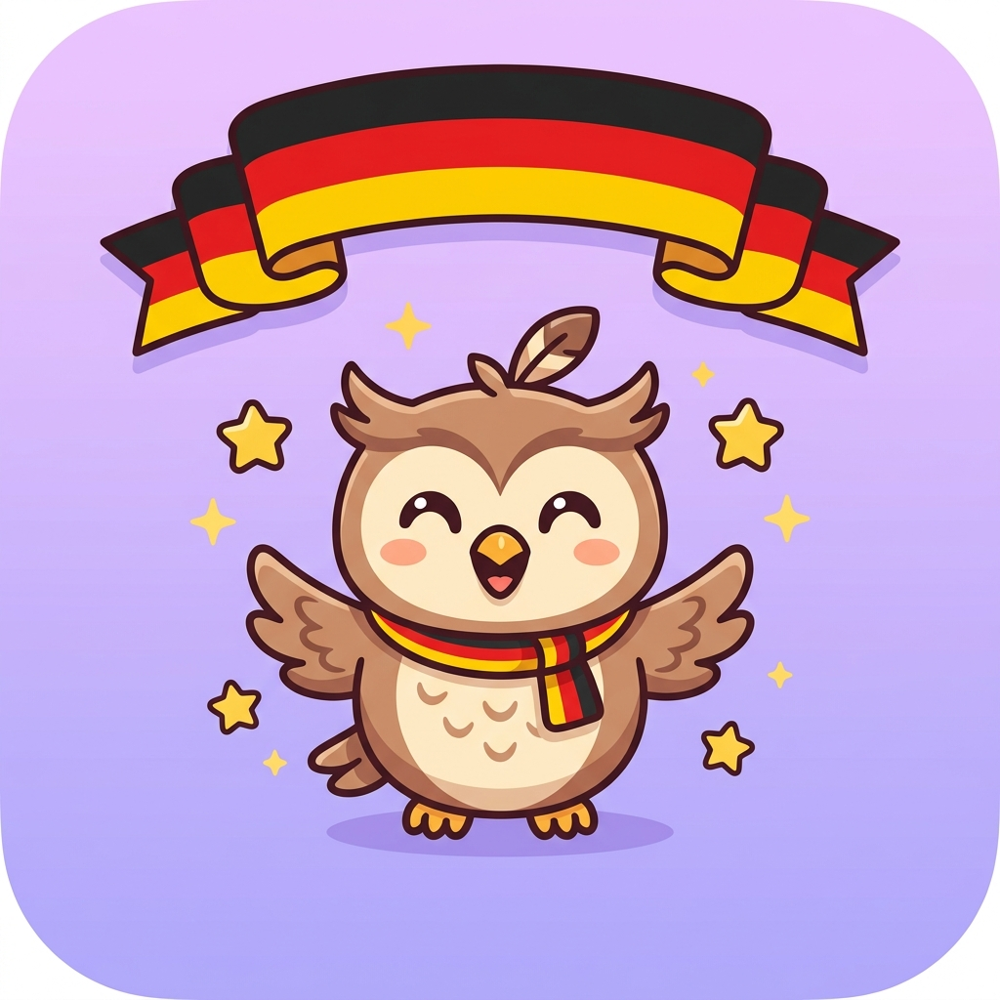

<div align="center">
  
  <h1>Deutsch für Kinder 🇩🇪</h1>
  <p><strong>Ứng dụng học tiếng Đức vui nhộn, tương tác dành cho người mới bắt đầu (Trình độ A1)</strong></p>
</div>

<br>

## 🌟 Giới thiệu

**Deutsch für Kinder** là một ứng dụng Web (Progressive Web App) học tiếng Đức được thiết kế với giao diện vô cùng dễ thương và bắt mắt. Ứng dụng bám sát lộ trình **Tiêu chuẩn CEFR (A1)** dựa trên giáo trình nổi tiếng **Menschen A1**, giúp người học (đặc biệt là trẻ em và người mới bắt đầu) tiếp thu từ vựng và ngữ pháp một cách tự nhiên thông qua các trò chơi và bài tập tương tác.

Đi cùng bạn trong suốt chặng đường học tập là **Mascot Luna 🦄** – một người bạn đồng hành ảo luôn cổ vũ, khen ngợi khi bạn làm đúng và động viên khi bạn làm sai!

## ✨ Tính năng nổi bật

*   **📚 Giáo trình Chuẩn (Menschen A1):** Hệ thống dữ liệu bài học khổng lồ bao gồm 24 bài học (Lektionen) từ mức độ làm quen chữ cái, chào hỏi đến thì quá khứ, chỉ đường.
*   **🦄 Mascot Tương tác (Luna):** Luna được tích hợp sâu vào giao diện, nhảy múa ăn mừng khi bạn chọn đúng đáp án và buồn bã khi bạn sai.
*   **🎮 Gamification (Học qua trò chơi):** Hệ thống cấp độ (Level), điểm kinh nghiệm (XP), thu thập sao (Stars) và duy trì chuỗi học tập (Streak) mỗi ngày.
*   **📱 Progressive Web App (PWA):** Có thể cài đặt trực tiếp lên điện thoại hoặc máy tính như một ứng dụng Native thực thụ (chạy offline, icon màn hình chính, giao diện tràn viền).
*   **🎨 Giao diện Hiện đại (Premium UI):** Áp dụng thiết kế Glassmorphism, animations mượt mà, màu sắc sinh động (vibrant) và âm thanh sống động.

## 🚀 Công nghệ sử dụng

Dự án được xây dựng hoàn toàn bằng **Vanilla Web Technologies**, đảm bảo tốc độ siêu nhanh và dung lượng cực nhẹ:
*   **HTML5 & CSS3** (CSS Variables, Flexbox, CSS Animations)
*   **Vanilla JavaScript (ES6 Modules)** (Không sử dụng Framework nặng nề)
*   **Service Workers** & Web App Manifest (Cho tính năng PWA)

## 📂 Cấu trúc mã nguồn

```bash
Education/Germany/
├── 📁 css/          # Chứa styles.css (hệ thống thiết kế)
├── 📁 data/         # Dữ liệu 24 bài học (a1.js, a2.js...)
├── 📁 img/          # Hình ảnh Mascot, icons, backgrounds
├── 📁 js/           # ES6 Modules (app.js là router chính)
│   ├── components/  
│   ├── games/       # Logic các bài học tương tác
│   └── screens/     # Giao diện các màn hình (Home, Lesson, Splash...)
├── 📁 tools/        # Python scripts để gen data
├── index.html       # Khung sườn chính của App
├── manifest.json    # Cấu hình PWA
└── sw.js            # Service Worker (Cache control)
```

## 🛠 Hướng dẫn chạy thử nghiệm (Local)

Vì ứng dụng sử dụng kiến trúc **ES6 Modules** (`<script type="module">`), bạn không thể click đúp để mở file `index.html` (do giới hạn CORS của trình duyệt). Hãy làm theo các bước sau:

1. Clone dự án về máy:
   ```bash
   git clone https://github.com/thongndac/German-Learning.git
   ```
2. Sử dụng một Local Web Server. Khuyến nghị dùng **Live Server** extension trong VS Code.
3. Nhấp chuột phải vào `index.html` -> Chọn **Open with Live Server**.
4. Trải nghiệm việc học tiếng Đức cùng Luna!

## 🤝 Đóng góp (Contributing)
Đây là một dự án cá nhân nhằm mục đích giáo dục. Mọi ý tưởng đóng góp (thêm bài học, tính năng flashcard, tối ưu UI...) đều được chào đón. Hãy mở một Issue hoặc tạo Pull Request.

---
<div align="center">
  <i>Viel Spaß beim Deutschlernen! 🇩🇪 (Chúc bạn học tiếng Đức thật vui!)</i>
</div>
